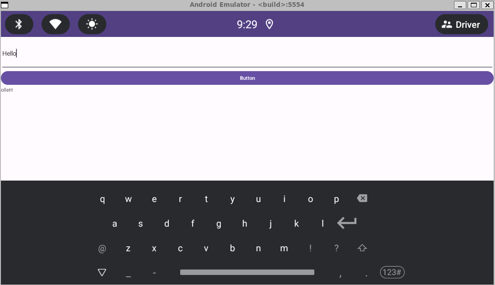
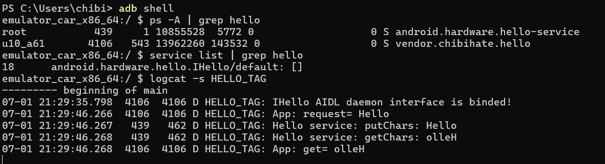

# aosp_aidl_for_hal
## Overview
This is Android AIDL interface example

## Requirements
* [Set up for AOSP development](https://source.android.com/docs/setup/start/requirements)

## Do
1. Create a folder to store Android 13
```
mkdir aosp
cd aosp
```

2. Clone the official AOSP manifest Android 13 and sync it
```
repo init -u https://android.googlesource.com/platform/manifest -b android-13.0.0_r15 --depth=1
repo sync -c -j$(nproc --all) --force-sync --no-clone-bundle --no-tags
```

3. Setup enviroment inside aosp before building and build it
```
source build/envsetup.sh
lunch sdk_car_x86_64-userdebug
make -j$(nproc)
```
4. Clone project into aosp workspace

5. Writing an AIDL client
* AIDL clients must declare themselves in the compatibility matrix in ```hardware/interfaces/compatibility_matrices/compatibility_matrix.current.xml``` and ```hardware/interfaces/compatibility_matrices/compatibility_matrix.7.xml``` OR declare in device ```device/generic/goldfish/compatibility_matrix.xml```
```
    <hal format="aidl" optional="true">
        <name>android.hardware.hello</name>
        <version>1</version>
        <interface>
            <name>IHello</name>
            <instance>default</instance>
        </interface>
    </hal>
```


6. Add vendor config to your device descriptor make file (```device/generic/goldfish/car/sdk_car_x86_64.mk```)
```
$(call inherit-product, vendor/chibihate/config.mk)
```

7. Define SELinux policy for HAL service
* Declare attribute in
```system/sepolicy/public/attributes``` and ```system/sepolicy/prebuilts/api/33.0/public/attributes``` for current version
```
# define hal_hello, hal_hello_client, hal_hello_server
hal_attribute(hello);
```
* Declare new type service in ```system/sepolicy/public/service.te``` and ```system/sepolicy/prebuilts/api/33.0/public/service.te```
```
# define hal_hello_service
type hal_hello_service, vendor_service, protected_service, hal_service_type, service_manager_type;
```

* Set service context interface in ```system/sepolicy/private/service_contexts``` and ```system/sepolicy/prebuilts/api/33.0/private/service_contexts```
```
# bind an AIDL service name to the selinux type
android.hardware.hello.IHello/default                                u:object_r:hal_hello_service:s0
```

* Set binder policy with a new file created in ```system/sepolicy/public/hal_hello.te``` and ```system/sepolicy/prebuilts/api/33.0/public/hal_hello.te```
```
# allow binder connection from client to server
binder_call(hal_hello_client, hal_hello_server);

# allow client to find the service, allow server to register the service
hal_attribute_service(hal_hello, hal_hello_service);

# allow binder communication from server to service_manager
binder_use(hal_hello_server);
```

* Ignore in lower API means API 32 in ```system/sepolicy/private/compat/32.0/32.0.ignore.cil``` and ```system/sepolicy/prebuilts/api/33.0/private/compat/32.0/32.0.ignore.cil```
```
(type new_objects)
(typeattribute new_objects)
(typeattributeset new_objects
  ( new_objects
    hal_hello_service
))
```

* Define default domain with a new file created in ```system/sepolicy/vendor/hal_hello_default.te``` OR ```device/generic/goldfish/sepolicy/common/hal_hello_default.te```
```
# Define the service domain
type hal_hello_default, domain;
type hal_hello_default_exec, exec_type, vendor_file_type, file_type;

# Allow init to transition to the service domain
init_daemon_domain(hal_hello_default);
# platform_app act as client for hal_hello
hal_client_domain(platform_app, hal_hello);
# hal_hello_default act as server for hal_hello
hal_server_domain(hal_hello_default, hal_hello);

# Allow the service to execute the binary
allow hal_hello_default vendor_data_file:file rw_file_perms;
```

* Add a new label in ```system/sepolicy/vendor/file_contexts```  OR ```device/generic/goldfish/sepolicy/common/file_contexts```
```
/(vendor|system/vendor)/bin/hw/android\.hardware\.hello-service               u:object_r:hal_hello_default_exec:s0
```

8. Build
```
mmm vendor/chibihate/hello
make -j$(nproc)
```

9. Start emulator
```
emulator -verbose -show-kernel -writable-system -gpu swiftshader_indirect -no-audio -wipe-data -memory 8192 -cores 4
```
10. Result



## Reference
1. https://www.codeinsideout.com/blog/android/hal/aidl/#overview
2. https://github.com/arminn/android_vendor_interface_example/tree/default
3. https://source.android.com/docs/core/architecture/aidl/aidl-hals